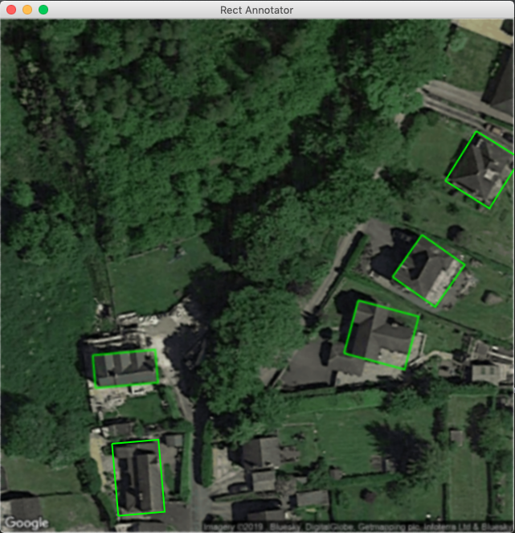

# Rect Annotator
An image annotation tool for drawing bounding boxes in different angles around objects in images.



## Why it was born?
First, I never like the idea of re-inventing the wheel. What I need is an image annotation tool for a very simple task: drawing bounding boxes in different angles around interested objects. I went through many available tools (free and paid) in the internet but none of them sastified me in doing such simple task. So here we go: A very simple and fast tool for quickly annotating image datasets.

We can use the polygon drawing function in some tools to draw a rectangle with angles. However, it can't draw an ideal rectangle and also it is never a ideal way to draw rectangles. In addition, some graphic tools draw the rectangle and rotate it following the object. This also wastes our time and effort to addjust the rectangle size and angle. Why don't we rotate the object to a right angle and simply draw a rectangle in a right angle. It can give us a TRUE rectangle and save a lot of our effort. That's the main idea of the tool.

## Required packages
* Python 3
* PyQt5 
```bash 
pip install pyqt5 
```

## Usage (5-second tutorial)


To make full use of our fingers, the UI has no button, menu or anything that wastes your clicks. We only need to press the key to adjust the angle of the image and drag the mouse to draw rectangles.

Everything we have to remember is:

<kbd>Q</kbd> : Rotate the image in anti-clockwise direction (5 degrees / stroke)

<kbd>W</kbd> : Rotate the image in clockwise direction (5 degrees / stroke)

<kbd>A</kbd> : Rotate the image in anti-clockwise direction (1 degree / stroke)

<kbd>S</kbd> : Rotate the image in clockwise direction (1 degree / stroke)

<kbd>T</kbd> : Delete the previous rectangle

How do you feel? Yes, it's very simple and fast. You even don't waste any single key stroke when using it.

The annotation data will be stored in the same folder with your images with the name ```anns.txt```. To keep the UI simple, I don't create any input for image folder path, you need to modify the code to set the value for ```IMAGE_FOLDER_PATH```. Also, check out my iPython notebook in examples to see how to use the annotation data for crop patches from images.

You might notice that the display image gets blur everytime we draw a new rectangle. This is caused by the effect of rotating a pixmap many times. However, the quality of the image won't change so much when we use the annotation data to crop the image because a single rotation is performed for each cropping process.

## Contributing
Pull requests are welcome. For major changes, please open an issue first to discuss what you would like to change.

Please make sure to update tests as appropriate.

## License
[MIT](https://choosealicense.com/licenses/mit/)

